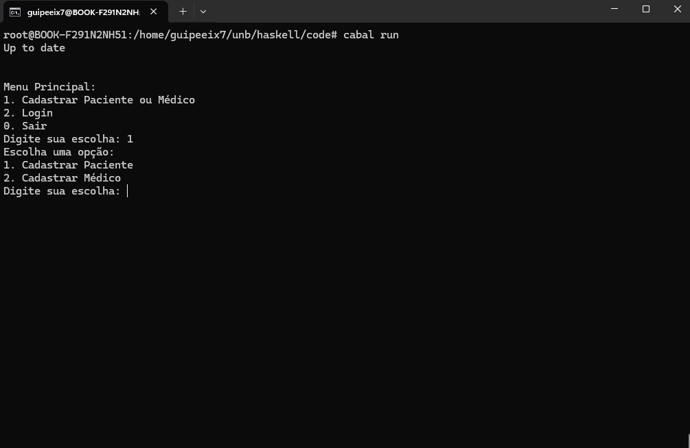
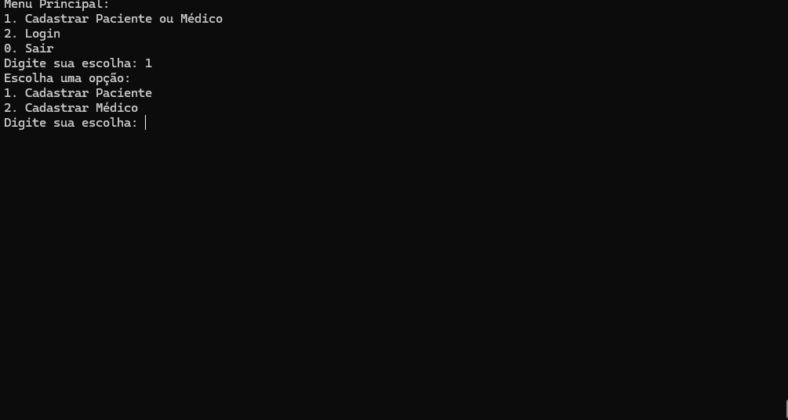
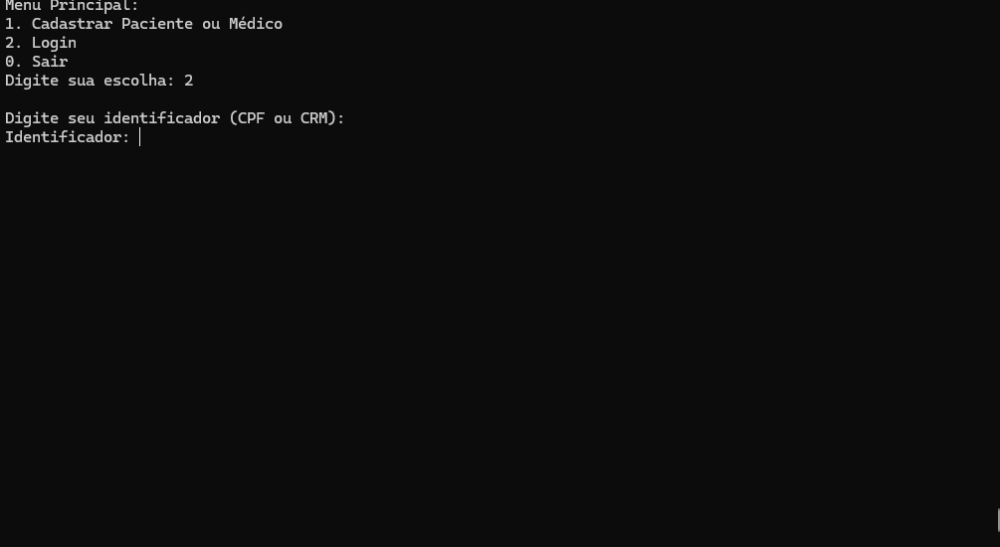
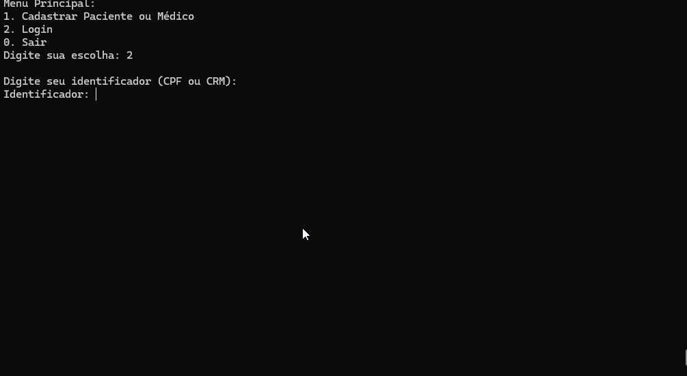
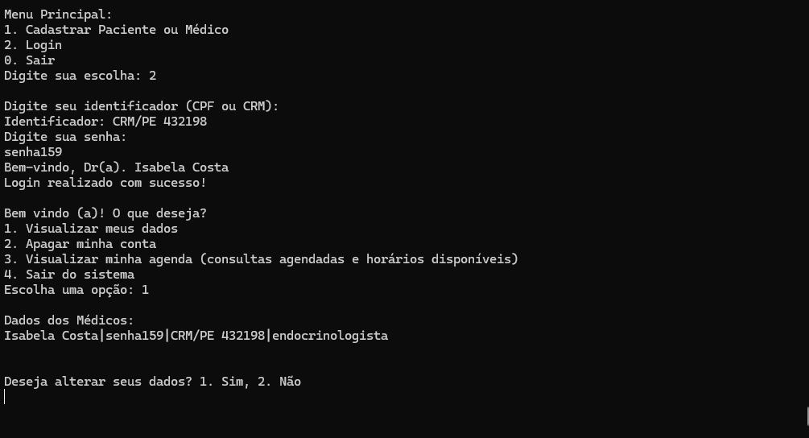
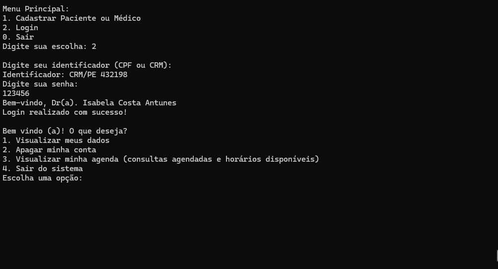
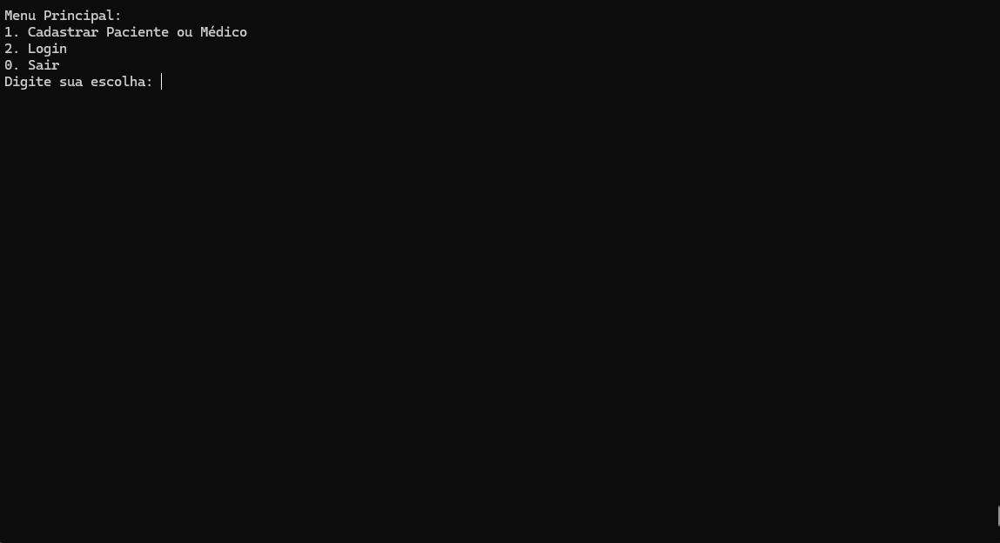
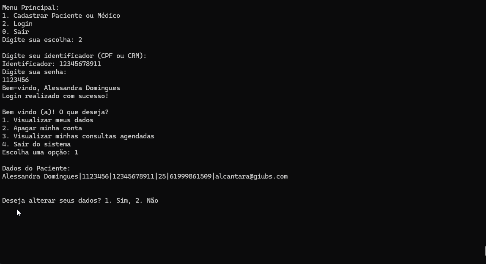
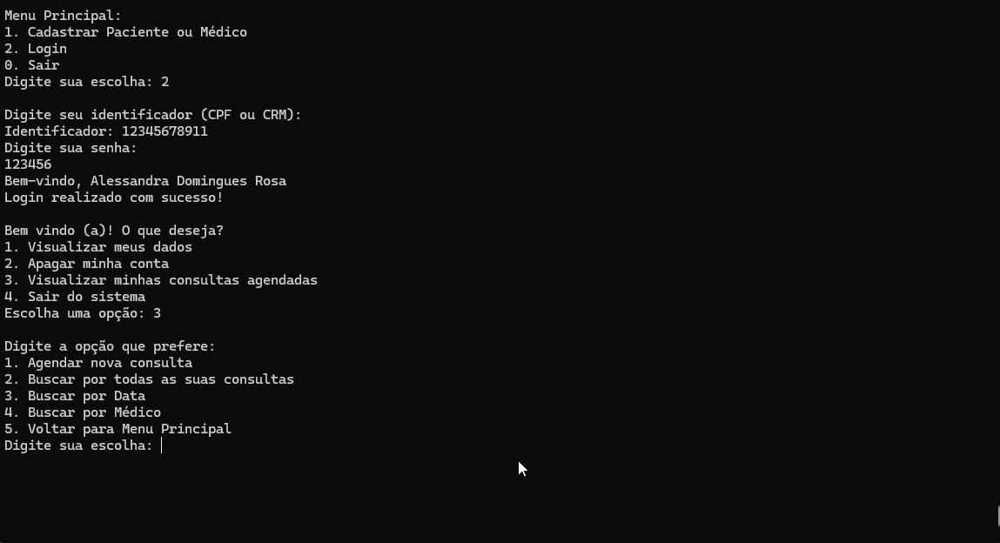

# Passo a Passo de como utilizar o projeto "Agendamento de Consultas"

- Passo 1. Clone o projeto em sua máquina:

```bash
 git clone https://github.com/UnBParadigmas2024-2/2024.2-G1-Funcional_Agendamento_de_Consultas.git
```

- Passo 2. Entre na pasta do projeto:

```bash
 cd 2024.2-G1-Funcional_Agendamento_de_Consultas
```

- Passo 2.1. Entre na pasta `code`:

```bash
 cd code
```

- Passo 3.  Execute o compilador do projeto:

```bash
 ghc -o SistemaGestao Main.hs 
 ```

- 3.1 Ou Compile o projeto e instale as dependências com:

```bash
 cabal build
```
- Passo 4. Rode o projeto:

 ```bash
 ./SistemaGestao 
```  
  
- 4.1 Ou Após o build inicie o projeto com:

```bash
 cabal run
```


# Passo a Passo de como usar o sistema funcional
Primeiramente, para usar o sistema, inicialmente rode-o segundo o [passo a passo](documentacao/passoapasso-uso.md).
Após tê-lo rodando:

1. Cadastre-se:

    
    
    

2. Faça Login:

   Login como médico

    

   Login como Paciente
    
    

- Se entrar como médico:
  - Visualize e altere seus dados: 
  
      

      
    
  - Visualize sua agenda:
    
      

  - Desmarque consulta
  
      
    
- Se entrar como paciente:
  - Visualize e altere seus dados:
    
      
    
      
    
  - Visualize suas consultas agendadas e marque novas consultas:
  
      
  
      
    
  - Apague sua conta:
    
      
